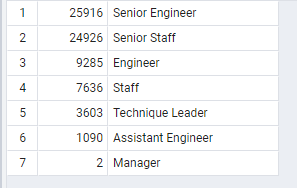

# Pewlett-Hackard-Analysis
## Overview
This analysis is mainly being conducted to find the list and count of employees who will soon be retiring and to find eligible employees who need to be mentored before the retires happen.

## Results
- As per the analysis of the retiring employees we can see that a total of 72458 employees are due for retirement based on the birth date.
- When we made a breakup of this list into department wise, we found out that out of the total retiring employees there were 25916 (36%) Senior Engineers and 24926 (34%) Senior staff retiring. While only 2 (0.0028%) Managers and 1090 (2%) Assistant engineers retiring. Image of breakup is below.

- The analysis for the employees eligible for the mentorship program shows that a total of 1549 employees are eligible for mentorship. The breakup is as shown in the image blow.

- As per the breakup there are no managers that are eligible for the mentorship. 

